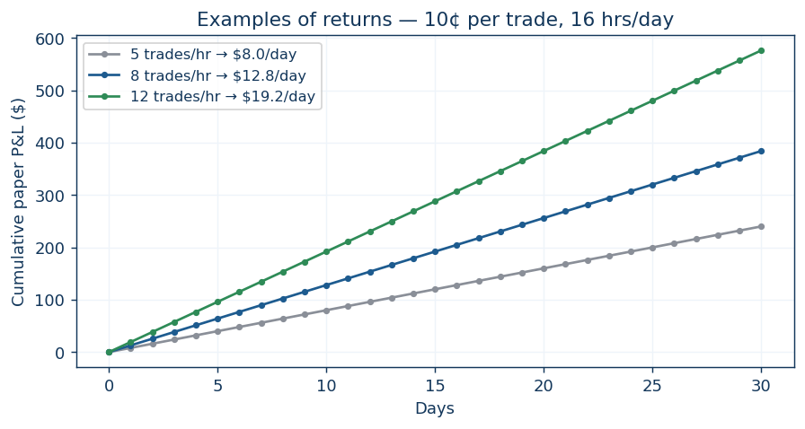

# Kalshiman

Kalshiman is an autonomous Kalshi prediction-market trading system. It learns
from a full reliability dataset of every round it has watched, scores live
markets with a gradient-boosted trend model, reasons about each setup like a
trader watching the tape, and only acts when the setup is *just right* —
neither too hot (chasing noise) nor too cold (missing winners).

> **Current standard (V2)** — GBM entry gate, tiered limit-stops, 3-minute
> recovery grace, 1.5s fast stop checks, review on every close.
> Best measured hour: **8 trades, 8W/0L, +88.96¢, avg +11.12¢/trade,
> max drawdown $0.00.**


## Why it works — three layers

Trading is a Goldilocks problem. Too hot — trusting hunches, chasing every
wiggle, stopping on noise — and the noise eats you. Too cold — a static
formula that never lets winners breathe — and you get stopped out of wins or
miss them entirely. Kalshiman balances three layers:

1. **Calibrated statistics (the thermometer)** — a pure-JS gradient-boosted
   model that scores every live market. Out-of-sample: 93.1% entry-only,
   96.7% with the first minutes of trend, **98.4% on high-confidence calls**.
2. **Reasoning observation (the trader's eye)** — a local LLM reads every
   round's snapshot like a trader would and gives a YES/NO/PASS opinion with a
   one-line reason. Advisory only, logged and scored.
3. **Discipline (the hand)** — high-confidence entries only, tiered
   limit-stops, a recovery grace so winners breathe, and fills marked at the
   stop level so a crash price is never booked.

See [docs/14-reasoning.md](docs/14-reasoning.md) for the full argument and
[ARCHITECTURE.md](ARCHITECTURE.md) for how it is built.

## What changed in the rework

1. **Reliability dataset** — 105,888 rounds structured as *entry snapshot →
   trend path → resolution*, with the account's real fills overlaid, plus a
   leakage audit that PASSES.
2. **GBM trend model** — the decision layer, trained on that dataset.
3. **Strict entry gate** — paper entries require the GBM ≥85% (or ≤15%) and
   agreement with the gate side.
4. **Tiered limit-stops** — 15¢ for entries ≥90¢, 8¢ below; fills at the stop
   level.
5. **3-minute recovery grace** — transient dips keep the position; sustained
   breaks still close at the stop.
6. **Fast stop checks** — 1.5 seconds, paper and live.
7. **Evaluation by default** — every close is reviewed against the real
   resolution, and a live dashboard + CLI show exactly what the models see.

## Performance


| Config | Trades | W/L | Net | Avg/trade | Max DD |
| --- | --- | --- | --- | --- | --- |
| V0 legacy | 5 | 4W/1L | +1.0¢ | +0.2¢ | 65¢+ |
| + fast paper stops / 85% GBM bar | 7 | 6W/1L | +45.0¢ | +6.4¢ | 19.74¢ |
| + tiered stops (15¢/8¢) | 5 | 5W/0L | +48.5¢ | +9.7¢ | $0 |
| **+ 3-min grace (STANDARD)** | **8** | **8W/0L** | **+88.96¢** | **+11.12¢** | **$0** |

Model quality (out-of-sample): 

Stop review (the rework's 15 stops): 

Live prediction accuracy: 89.5% model / 99% market over 200 resolved calls.

### Examples of returns

At the standard hour's pace — **~8 trades/hour at ~+11¢ average** — the
realistic paper trajectory is roughly $0.60–0.90/hour on the 15m book. The
scenarios in [docs/15-returns.md](docs/15-returns.md) show what different
throughput levels produce over a month:



All figures are **paper** until live mode is explicitly proven and enabled.

## Quickstart

```powershell
# Paper watcher (the standard). liveMode stays false — no real orders.
node scripts/watch-headless.js

# Evaluation dashboard (auto-plays; server owns the state)
node scripts/eval-dashboard.js --rounds 300
# open http://127.0.0.1:8788

# CLI control plane for the dashboard
node scripts/eval-ctl.js status
node scripts/eval-ctl.js play|pause|step|restart|speed <ms>|goto <n>|round <n>
node scripts/eval-ctl.js selftest 300

# 1-hour paper-test harness on live data
node scripts/paper-test.js --minutes 60
# report: memory/paper-test-1h.md
```

## Reproducing the models

```powershell
node scripts/build-master-dataset.js    # rebuild the reliability dataset
node scripts/audit-leakage.js           # leakage audit (must PASS)
node scripts/train-continue.js          # 12-feature context models
node scripts/train-trend-model.js       # GBM A + B
python scripts/make-docs-charts.py      # regenerate the charts in docs/charts
```

## Documentation

- [ARCHITECTURE.md](ARCHITECTURE.md) — full system design, data schema, flow
- [docs/README.md](docs/README.md) — indexed guide (thesis, strategies,
  models, markets, risk, performance, account, network, app, lessons, FAQ,
  glossary, versions, reasoning, returns, charts, reference)
- [ENGINE-SUMMARY.md](ENGINE-SUMMARY.md) — current engine state and config
- [WALKTHROUGH.md](WALKTHROUGH.md) — operating the system day to day
- [docs/kalshiman-full-breakdown.pdf](docs/kalshiman-full-breakdown.pdf) — PDF
  version of the full breakdown

## Safety

- **Paper-only by default** — `liveMode: false`; no real orders until
  explicitly enabled and validated.
- Every event trade has a hard stop (15¢ / 8¢), a recovery grace, and a 1.5s
  check loop.
- No martingale, no revenge trading, no extreme leverage, no both-sides arbs.
- The real account is untouched: balance $23.09, zero open positions.
