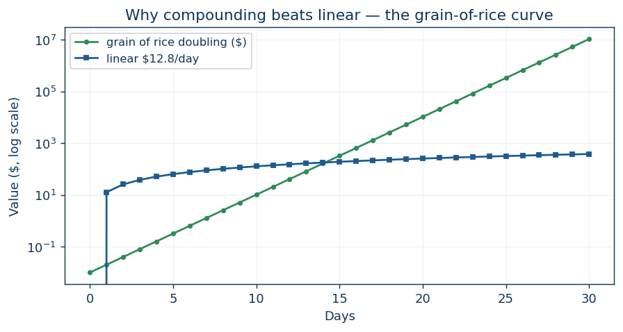

# Thesis — why the system works

## The edge

Ultra-short Kalshi markets (15-minute gold/silver/crypto) converge hard:
in the final minutes, a market implied at 90%+ resolves that way ~96–99% of
the time. The money is made by:

1. **Entering late** — only when the trend model is highly confident.
2. **Taking 10–15¢ per trade** — entry near 85–92¢, ride to 99–100¢.
3. **Never letting noise take a winner** — recovery grace + tiered stops.
4. **Capping the rare wrong call** — limit-stops fill at the stop level.

The rework proved the old approach (enter on market-implied gates, flat 8¢
stop, no recovery awareness) leaked money in two places: 17–65¢ gap-throughs
past the stop on paper, and stops that fired on transient dips which then
recovered and won. Both are gone in the standard.

## The data-first rule

Every decision is backed by the reliability dataset: 105,888 rounds structured
as *entry snapshot → trend path → resolution*, audited for leakage (PASS), and
scored by the review pipeline on every close. If a rule change can't be
justified from that data, it doesn't ship.

## Too hot or too cold — trading has to be just right

A trading system fails in two directions. **Too hot** — chasing every wiggle,
trusting hunches, stopping on noise — and the noise eats you. **Too cold** —
a static formula that never lets winners breathe and treats every round as
identical — and you get stopped out of wins or miss them entirely.

The standard system balances three layers: calibrated statistics (the GBM
thermometer), a reasoning observer (the LLM trader's eye), and discipline
(gates + tiered limit-stops + recovery grace). See
[14-reasoning](14-reasoning.md) for how and why this works.

## The one-grain-of-rice rule

Cents compound. +10¢ per trade × 10 trades/hour = $1/hour = $24/day at paper
scale, and each cent is protected by a hard stop. Throughput and win rate are
both levers; the stop policy keeps the downside bounded while the wins ride.
