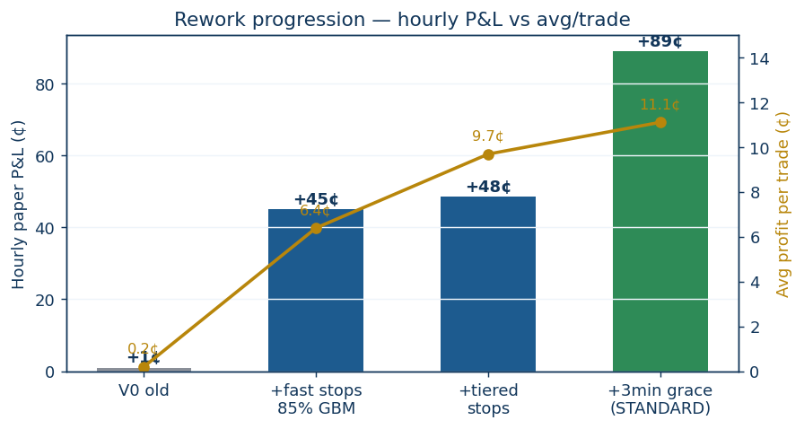
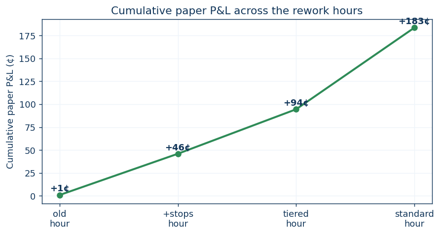
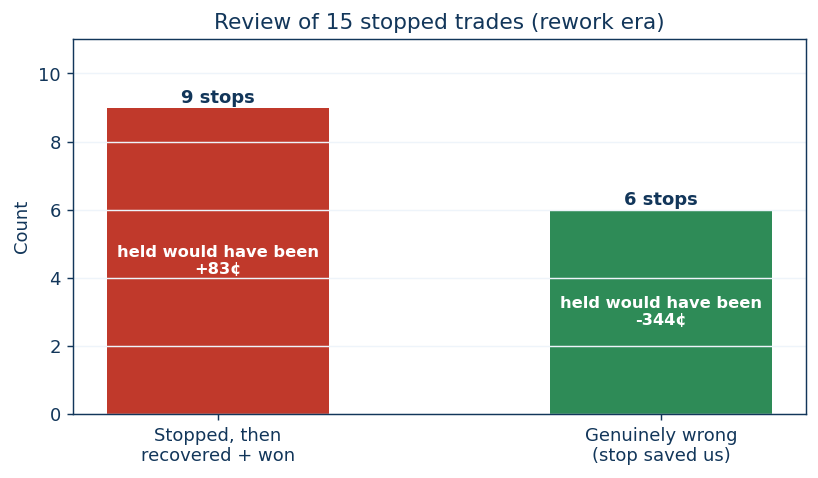
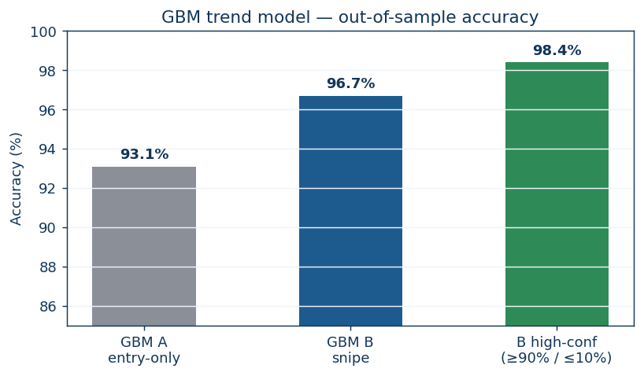
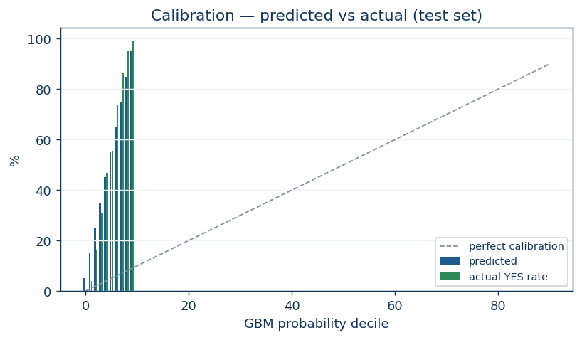

# Performance

Everything below is **paper** (real money is off). Fees are modelled at the
measured 0.63¢/contract.

## Rework progression

| Config | Trades | W/L | Net | Avg/trade | Max DD | Stops |
| --- | --- | --- | --- | --- | --- | --- |
| V0 legacy | 5 | 4W/1L | +1.0¢ | +0.2¢ | 65¢+ | several, gaped |
| + fast paper stops / 85% GBM bar | 7 | 6W/1L | +45.0¢ | +6.4¢ | 19.74¢ | 1 (recovered) |
| + tiered stops (15¢/8¢) | 5 | 5W/0L | +48.5¢ | +9.7¢ | $0 | 0 |
| **+ 3-min grace (STANDARD)** | **8** | **8W/0L** | **+88.96¢** | **+11.12¢** | **$0** | **0** |

## The standard hour, trade by trade (23:32Z→00:32Z)

| # | Market | Side | Entry | Exit | P&L | How |
| --- | --- | --- | --- | --- | --- | --- |
| 1 | KXGOLD15M | NO | 90¢ | 98¢ | +6.74¢ | bow-out |
| 2 | KXSILVER15M | YES | 81¢ | res | +23.00¢ | held to resolution |
| 3 | KXGOLD15M | NO | 93¢ | 97¢ | +2.74¢ | bow-out |
| 4 | KXSILVER15M | NO | 93¢ | res | +8.00¢ | held |
| 5 | KXGOLD15M | YES | 87¢ | 93¢ | +4.74¢ | bow-out |
| 6 | KXSILVER15M | YES | 86¢ | res | +16.00¢ | held |
| 7 | KXGOLD15M | NO | 93¢ | 99¢ | +4.74¢ | bow-out |
| 8 | KXSILVER15M | NO | 81¢ | res | +23.00¢ | held |

## What moved the needle

1. **Fast stops on paper** — the rework's biggest leak was 17–65¢ gap-throughs
   on paper trades (the fast loop only watched live). Fix: 1.5s checks on
   paper too.
2. **GBM entry gate (≥85%)** — removed the weak mid-price entries that
   produced the catastrophic wrongs (silver YES@91 → −89¢ held).
3. **Tiered limit-stops + 3-min grace** — turned "stopped then recovered"
   losses into wins. Review of the rework's 15 stops:

   9 recovered and won (held would have been +83¢); 6 were genuine wrongs
   (stop saved 344¢). Net the stops saved 155¢; the grace + limit-stop
   eliminated most of the 9 costs going forward.

## Model quality (out-of-sample)

- GBM entry-only (A): 93.1% · GBM snipe (B): 96.7% · B high-confidence:
  98.4% win rate (4,140 trades, +$188.24 sim).
- Calibration on the test set:

- Account what-if: real fills agreeing with the model won 92.5%; fills going
  against it won 6.4%.

## Live accuracy

Engine prediction stats over 200 resolved calls: **89.5% model / 99% market**.
Trade outcomes in the standard era: 100% win rate across the measured hours.

## Drawdown history

The standard era (tiered stops onward) has booked **$0.00 max drawdown** across
three measured windows. The earlier era's worst single stop was −63.74¢ (a
pre-fix gap-through on paper); the post-fix worst is −6.74¢ at the stop level.
