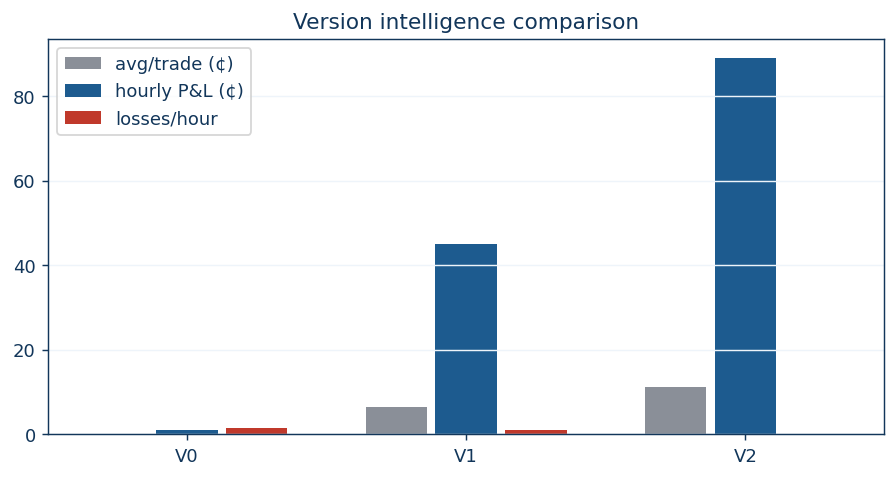

# Versions — system history and intelligence over time

This is the record of the systems Kalshiman has been, what each one could and
couldn't do, and how the intelligence improved at each step. The current
standard is **V2** (see [README](../README.md)).

## V0 — legacy (before the 2026-08-19 rework)

**What it was:** a gate-driven bot. It entered on market-implied gates
(signal / price / timing / EV), used a per-series 12-feature logistic model as
research, stopped every trade at a flat 8¢, and checked stops on the 5-second
engine tick. Qwen could veto entries. The signal pool was polled every 60s
through three overlapping paths.

**What it couldn't do:**
- See history: entries were judged by the current book + a static model, with
  no learned sense of how these markets resolve.
- Protect paper trades: stops on paper rode the 5s tick and gaped through by
  17–65¢ (worst: gold NO@80 exited at 15¢ = −63.74¢).
- Hold through noise: a transient dip hit the 8¢ stop and the position was
  gone — 9 of 15 stopped trades in this era recovered and won at resolution.
- Verify itself: there was no review of what would have happened.

**Measured:** reality check −$35.25 net over 308 account fills; the rework-era
ledger shows 48 trades at 69% win with −33.4¢ net before the fixes.

## V1 — rework foundation (early 2026-08-19)

**What was added:**
- **Reliability dataset** — 105,888 rounds structured as *entry snapshot →
  trend path → resolution*, with real account fills overlaid.
- **Leakage audit** — caught and removed same-closeTime prev-feature leaks and
  near-close trend candles (PASS after fixes).
- **GBM trend model** — pure-JS gradient boosting: entry-only 93.1% OOS,
  snipe 96.7% OOS, high-confidence 98.4%.
- **Eval dashboard + CLI control plane** — out-of-sample evaluation with
  reasoning drivers, charts, and a server-owned play state.
- **Qwen demoted** to advisory-only after it vetoed good NO entries with
  contradictory advice.

**Still missing:** fast stops covered live trades only, so paper kept eating
gap-throughs; the entry bar was 90% (few trades); stops still filled at crash
prices.

**Measured:** the first paper hour with fast paper stops + an 85% GBM bar hit
+45¢ (6W/1L), and the tiered-stop hour hit +48.5¢ (5W/0L) — the leap from the
old +1¢ hour.

## V2 — current standard (locked 2026-08-19 evening)

**What changed:**
- **GBM gate** — paper entries require the trend model ≥85% (or ≤15%) and
  agreement with the gate side. Vetoes: `gbm-low-conf`, `gbm-disagree`,
  `gbm-pending`, `gbm-warmup`.
- **Tiered limit-stops** — 15¢ for entries ≥90¢, 8¢ below; fills marked at
  the stop level, never a crash price.
- **3-minute recovery grace** — a breach must persist (or reach the final
  minute) before closing, so whipsaws keep the position and the winner.
- **Fast stops everywhere** — 1.5s checks on paper AND live.
- **Review on every close** — the `analysis` verdict (resWin / heldPnl /
  "The stop cost us…" / "Correct stop…") makes every policy change
  data-driven.

**Measured (standard hour):** 8W/0L, +88.96¢, avg +11.12¢/trade, max drawdown
$0.00, 0 errors, 0 stops. Follow-up window: 1W/0L +2.74¢. Live prediction
accuracy 89.5% (model) / 99% (market).

## Intelligence comparison

| Capability | V0 legacy | V1 foundation | V2 standard |
| --- | --- | --- | --- |
| Sees | current book | + candle history | + learned resolution dynamics (entry→trend→resolution) |
| Decides with | market-implied gates | + logistic | + GBM high-confidence gate |
| Stop model | flat 8¢ instant | flat 8¢ (paper gap-throughs) | tiered 15¢/8¢ limit-stop |
| Grace before stop | none | 30s | 3 min |
| Stop checks | 5s tick (paper) | 5s paper / 1.5s live | 1.5s paper + live |
| Entry bar | implied ≥~91% | GBM ≥90% | GBM ≥85% (more, still safe) |
| Self-verification | none | dashboard (OOS) | dashboard + review verdict per close |
| Qwen role | veto | advisory | advisory |
| Avg/trade | +0.2¢ | +6.4¢ | +11.12¢ |
| Hourly paper P&L | +1¢ | +45¢ | +88.96¢ |
| Losses / hour | ~1–2 | ~1 | 0 |
| Max drawdown (hour) | 65¢+ | 19.74¢ | $0.00 |
| Model prediction acc | ~86% | ~87.5% | 89.5% |

## The intelligence story

1. **V0** pattern-matched prices and punished itself for noise — the flat stop
   turned transient dips into guaranteed losses and crash prices into 50¢
   gap-throughs.
2. **V1** learned the game from data: it built a truthful dataset, a
   calibrated model, and an honest evaluation loop. It could finally *see*
   how rounds resolve — but still exited like the old system.
3. **V2** combined seeing with behaving: it only enters when the model is
   confident, it lets winners ride through noise, it caps the rare wrong call
   at the stop level, and it audits every close. The result is an hour with
   zero losses, zero stops, and an 11¢ average trade.

The system did not get "smarter" only by adding parameters — it got smarter by
learning from its own outcomes (dataset + reviews), refusing weak setups
(GBM gate), and understanding the difference between noise and signal
(recovery grace + limit-stop fills).

## Why V0 failed and why a reasoning observer was needed

The original brain was a static function: one snapshot of numbers in, one
probability out. It could not know *how the market got here*, could not tell
noise from signal, and never reviewed its own trades — so it was too cold:
mechanical, context-blind, and stopped out of winners on noise.

Trading is too hot or too cold; it has to be just right. A reasoning
observer (the LLM) was added to give the system a trader's eye — watching
the snapshot, trend path and series history, and asking "does this look like
the setups that win?" — while the calibrated GBM supplies "what is most
likely" and the gates/stops supply discipline. See
[14-reasoning](14-reasoning.md) for the full explanation of how the three
layers balance each other.

## Version guardrails (unchanged across all versions)

- Paper until proven; no martingale; no revenge trading; no extreme leverage;
  both-sides arbs disabled.
