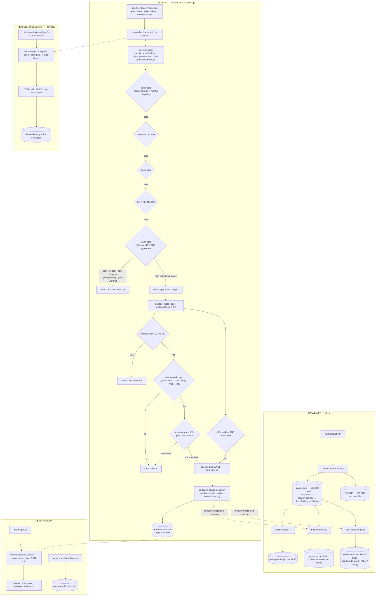

# System diagram — the full flow, granular

This is the complete V2 system, from data to live loop to review. GitHub
renders the Mermaid diagram natively; the PDF includes the charts but not the
interactive diagram.

## Reading the diagram

- **Data layer** — built once, audited for leakage (PASS), then used to train
  both the per-series logistic models and the GBM trend models. Reviews from
  live closes feed back into retraining.
- **Live loop** — every 5s the watcher discovers active markets; the researcher
  scores each with logistic + GBM; gates filter; the GBM gate is the final
  paper entry authority; open trades are managed every tick AND every 1.5s by
  the fast-stop loop; exits are bank/bow-out on winners or tiered limit-stops
  with a 180s recovery grace.
- **Reasoning observer** — Qwen reads the same snapshot a trader would and
  gives a scored second opinion; it never decides.
- **Observability** — the dashboard (server-owned state, out-of-sample only),
  the CLI control plane, and the hour harness all read the same ledger.
